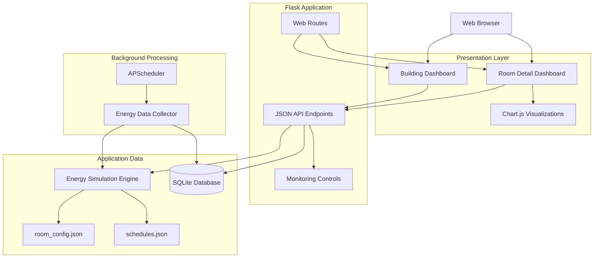

<div align="center">


### **Room-level energy monitoring, historical analysis, and operational visibility through a Flask-based web dashboard.**

<br/>


<br/>


<br/><br/>

<a href="https://github.com/abarman079/EWU_FUB_EnergyMonitor">

</a>

</div>

---

# **Overview**

**FUB BEMS** is a web-based **Building Energy Monitoring System** designed to model room-level electricity monitoring across an academic building.

The application combines a **Flask backend**, **SQLite persistence**, schedule-aware simulated energy data, background data collection, REST-style endpoints, and a responsive monitoring interface.

It provides both a **building-wide operational view** and dedicated **room-detail dashboards** for examining power consumption, current, voltage, room state, daily energy usage, estimated cost, equipment information, and historical trends.

The project was developed in the context of **CSE407 Green Computing**, with an emphasis on energy visibility, monitoring, and data-driven building management.

> **Project scope:** the current implementation uses simulated telemetry to model a Building Energy Management System. It does not currently ingest measurements from physical IoT meters or sensors.

---

<div align="center">

# **Technology Stack**

<br/>


<br/><br/>


<br/>


</div>

---

# **What the System Does**

<div align="center">

### **Building Monitoring**

</div>

The main dashboard provides a consolidated view of the building's current energy state.

It displays:

* Total power demand
* Active room count
* Estimated daily energy consumption
* Estimated daily electricity cost
* CO₂-related metric
* Individual room status
* Room equipment information
* Monitoring state
* Course information
* Floor and status filtering

<br/>

<div align="center">

### **Room-Level Monitoring**

</div>

Each configured room has a dedicated detail page containing:

* Current power consumption
* Electrical current
* Voltage
* Current room state
* Estimated daily energy consumption
* Estimated daily operating cost
* Assigned course information
* Equipment configuration
* Historical measurements
* Power-consumption trend
* Current and voltage analysis
* Hourly energy visualization

<br/>

<div align="center">

### **Monitoring Controls**

</div>

The application supports:

* Global monitoring pause/resume
* Individual room monitoring control
* Persistent room-monitoring state using SQLite
* Automatic dashboard updates
* Background measurement collection

---

# **Key Features**

<div align="center">


<br/><br/>


<br/><br/>


<br/><br/>


<br/><br/>


<br/><br/>


</div>

---

# **System Architecture**



---

# **How Data Moves Through the Application**

```text
Room Configuration + Class Schedule
                │
                ▼
      Energy Simulation Engine
                │
                ▼
        Current Room Metrics
                │
          ┌─────┴─────┐
          ▼           ▼
     Flask APIs   APScheduler
          │           │
          │           ▼
          │      SQLite History
          │           │
          └─────┬─────┘
                ▼
          Web Dashboard
                │
                ▼
     Charts + Room Monitoring
```

### **Runtime behavior**

* The simulation engine determines room status and electrical values.
* Room configuration defines capacity, installed equipment, floor, and expected wattage.
* Schedule data provides course and classroom activity information.
* Flask exposes current and historical data through JSON endpoints.
* APScheduler periodically records measurements into SQLite.
* The browser periodically requests fresh building and room information.
* Historical data is used for room-level charts and analysis.

---

# **Energy Data Model**

The primary historical dataset stores:

| Field       | Purpose                       |
| ----------- | ----------------------------- |
| `room_id`   | Identifies the monitored room |
| `timestamp` | Measurement timestamp         |
| `power`     | Electrical power in watts     |
| `current`   | Electrical current            |
| `voltage`   | Supply voltage                |
| `status`    | Room operating state          |

A second SQLite table maintains whether monitoring is enabled for each room.

---

# **Room Operating States**

The simulation can represent different operational conditions.

### `ONLINE`

The room is active and its configured electrical equipment contributes to the simulated load.

### `STANDBY`

The room is not actively being used and consumes a reduced standby load.

### `OFFLINE`

The room represents an unavailable or offline state and produces only a minimal simulated electrical load.

---

# **Schedule-Aware Simulation**

Room behavior is connected to configuration data stored in:

```text
room_config.json
schedules.json
```

Each room can define information such as:

```json
{
  "floor": 1,
  "capacity": 60,
  "equipment": [
    "Projector",
    "AC",
    "Lights",
    "Computers"
  ],
  "wattage": 4500
}
```

Schedule data associates rooms with course information and time ranges.

The simulation uses that information to determine whether a room should behave as an active classroom or remain in standby mode.

---

# **REST Endpoints**

The Flask application exposes a small API used by the dashboard.

| Method | Endpoint                                | Purpose                         |
| ------ | --------------------------------------- | ------------------------------- |
| `GET`  | `/`                                     | Building dashboard              |
| `GET`  | `/room/<room_id>`                       | Individual room dashboard       |
| `GET`  | `/api/building/status`                  | Current building and room state |
| `GET`  | `/api/room/<room_id>/status`            | Current metrics for one room    |
| `GET`  | `/api/room/<room_id>/history`           | Historical room measurements    |
| `POST` | `/api/monitoring/toggle`                | Toggle global monitoring        |
| `POST` | `/api/room/<room_id>/monitoring/toggle` | Toggle monitoring for one room  |

Historical queries can also use the `hours` parameter:

```text
/api/room/101/history?hours=24
```

---

# **Dashboard Metrics**

The building API combines room information into higher-level metrics including:

```text
Total Building Power
Active Rooms
Daily Energy
Daily Cost
CO₂ Metric
Room Equipment
Room Monitoring State
```

Estimated electricity cost is derived from the simulated daily energy calculation.

---

# **Room Analytics**

The room-detail interface provides multiple visualizations using **Chart.js**.

### Power Consumption

A line chart displays recent room power measurements.

### Current & Voltage

A multi-axis chart compares electrical current and voltage over time.

### Energy Trend

Historical data is also represented as an energy-consumption chart for easier interpretation.

---

# **Automatic Data Collection**

The Flask application uses **APScheduler** to run background collection.

```text
Application starts
      │
      ▼
Initialize SQLite
      │
      ▼
Initialize room monitoring state
      │
      ▼
Start APScheduler
      │
      ▼
Collect room data periodically
      │
      ▼
Store measurements in SQLite
```

The background collector records:

```text
room
timestamp
power
current
voltage
status
```

This creates historical data that can later be queried from the room-history endpoint.

---

# **Responsive Interface**

The dashboard contains responsive layout rules for smaller displays.

Desktop layouts use wider metric and room grids, while smaller screens collapse major sections into single-column layouts.

The interface uses a black terminal-inspired visual system built around:

```text
Black / charcoal surfaces
White typography
Green active-state accents
Red offline-state accents
Orange monitoring indicators
Monospace typography
Structured grid layouts
```

---

# **Project Structure**

```text
EWU_FUB_EnergyMonitor/
│
├── app_bems_black.py
│   └── Flask application, APIs, SQLite and scheduler
│
├── simulate_data.py
│   └── Schedule-aware energy simulation
│
├── room_config.json
│   └── Room, floor, equipment and load configuration
│
├── schedules.json
│   └── Course and room schedule configuration
│
├── templates/
│   ├── building_dashboard_black.html
│   │   └── Main building-monitoring dashboard
│   │
│   └── room_detail_black.html
│       └── Individual room dashboard and charts
│
├── requirements.txt
│   └── Python dependencies
│
├── runtime.txt
│   └── Python runtime configuration
│
├── render.yaml
│   └── Render deployment configuration
│
└── README.md
    └── Project documentation
```

---

# **Getting Started**

## **1. Clone the repository**

```bash
git clone https://github.com/abarman079/EWU_FUB_EnergyMonitor.git
cd EWU_FUB_EnergyMonitor
```

## **2. Create a virtual environment**

### Windows

```powershell
python -m venv .venv
.venv\Scripts\activate
```

### macOS / Linux

```bash
python3 -m venv .venv
source .venv/bin/activate
```

## **3. Install dependencies**

```bash
pip install -r requirements.txt
```

The project currently uses:

```text
Flask 3.0.0
APScheduler 3.10.4
pytz 2023.3
```

## **4. Start the application**

```bash
python app_bems_black.py
```

The application will start on:

```text
http://localhost:5000
```

Open that address in your browser.

---

# **Database Initialization**

No manual SQLite setup is required for local development.

When the application starts, it automatically creates the required database structure if it does not already exist.

The generated local database is:

```text
energy_bems.db
```

It stores:

```text
Historical energy measurements
Room monitoring states
```

---

# **Configuration**

## `room_config.json`

Controls room-specific information such as:

* Floor
* Capacity
* Equipment
* Expected wattage

## `schedules.json`

Controls:

* Course code
* Course name
* Classroom schedule
* Activity windows

These files allow the simulation to be modified without changing the main Flask application.

---

# **Deployment**

A `render.yaml` Blueprint is included for deployment on **Render**.

The current configuration uses:

```yaml
runtime: python
buildCommand: pip install -r requirements.txt
startCommand: python app_bems_black.py
```

with Python `3.12.0`.

For another Python hosting platform, the main process is:

```bash
pip install -r requirements.txt
python app_bems_black.py
```

> For a production deployment, persistent database storage and production-grade server configuration should be considered instead of relying solely on a local SQLite file and the Flask development server.

---

# **Current Project Scope**

This project is best viewed as a **Building Energy Management System prototype and simulation platform**.

### Included

* Flask web application
* Building-wide dashboard
* Room-level monitoring
* Schedule-aware simulated data
* SQLite historical storage
* JSON configuration
* REST-style API endpoints
* Monitoring controls
* Chart-based analysis
* Periodic background collection
* Responsive interface

### Not currently included

* Physical smart meters
* MQTT or other IoT messaging
* Hardware sensor ingestion
* User authentication
* Cloud database persistence
* Automated alert notifications
* Production observability

Being explicit about this distinction keeps the project technically accurate while leaving a clear path for future expansion.

---

# **Possible Future Improvements**

### **IoT Integration**

Replace simulated telemetry with measurements from:

```text
Smart meters
ESP32 / ESP8266 devices
Current sensors
Energy meters
MQTT brokers
```

### **Production Data Layer**

Move historical measurements from SQLite to:

```text
PostgreSQL
TimescaleDB
InfluxDB
```

for stronger long-term time-series storage.

### **Authentication & Authorization**

Add secure accounts for roles such as:

```text
Administrator
Facility Manager
Viewer
```

### **Energy Alerts**

Introduce threshold-based alerts for:

```text
Unusual power demand
Unexpected after-hours usage
Equipment anomalies
Room outages
```

### **Reporting**

Add:

```text
Daily reports
Weekly consumption reports
Floor comparisons
Peak-demand analysis
CSV/PDF export
```

### **Testing & CI**

Add:

```text
pytest
API tests
Simulation tests
GitHub Actions
Automated linting
Deployment checks
```

---

# **Engineering Concepts Demonstrated**

This project demonstrates practical experience with:

* Flask application development
* REST-style endpoint design
* Background job scheduling
* SQLite persistence
* SQL queries
* JSON-driven configuration
* Simulated telemetry
* Time-aware application logic
* Data aggregation
* Historical-data APIs
* Client/server communication
* Chart-based data visualization
* Responsive frontend design
* Deployment configuration
* Building-energy application concepts

---

# **Why This Project Matters**

Energy-monitoring software becomes useful when raw electrical measurements can be transformed into understandable operational information.

FUB BEMS explores that workflow:

```text
Raw Measurements
       ↓
Room Status
       ↓
Historical Storage
       ↓
Energy Metrics
       ↓
Visualization
       ↓
Operational Insight
```

The project combines **software development, energy awareness, data visualization, and monitoring-system concepts** in a single web application.

---

<div align="center">

# **Author**

### **Md. Akibul Hasan Arman**

Computer Science & Engineering Graduate
Full-Stack Development · Backend Development · Data · Computer Vision

<br/>

<a href="https://github.com/abarman079">

</a>

 

<a href="https://www.linkedin.com/in/md-akibul-hasan-arman-81857b339/">

</a>

<br/><br/>

### **FUB Building Energy Monitoring System**

*Flask · SQLite · APScheduler · Chart.js · Python*


</div>
